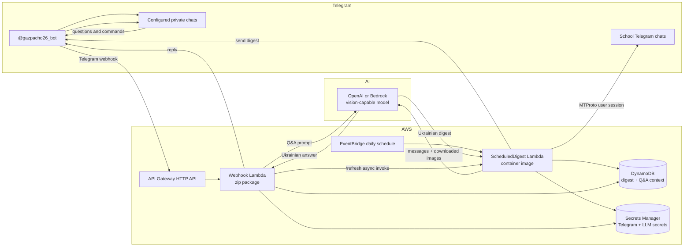

# Gazpacho

Personal Telegram digest bot for Spanish school updates, summarized in Ukrainian.

Gazpacho has two separate Telegram identities:

- A Telegram user client, implemented with Telethon/MTProto, logs in as the parent's own account and reads the configured school chats. This is required because a Telegram bot cannot fetch chat history for chats where it is not present.
- A normal Telegram bot sends scheduled digests and receives follow-up questions in one or more configured private chats.

The interactive Telegram user login happens only once on a local machine. Cloud code receives a pre-created Telethon `StringSession` from AWS Secrets Manager and never asks for a phone number, login code, or 2FA password.

## Current State

Gazpacho supports the full production flow:

- Daily scheduled digest through EventBridge, SAM, and a container Lambda.
- Telegram webhook Q&A through API Gateway and a zip Lambda.
- OpenAI as the default vision-capable LLM provider, with Amazon Bedrock as an optional provider.
- Multiple private Telegram recipients through `TARGET_CHAT_IDS`.
- GitHub Actions for pull request CI and manual production deploys.

## Architecture

AWS deployment overview:



The Telegram bot never reads source chats. Only the Telethon user-client session in the scheduled Lambda reads the configured school chats.

Daily digest flow:

```text
EventBridge cron, configured with SCHEDULE_HOUR/SCHEDULE_MINUTE in UTC
  -> ScheduledDigest Lambda container image
       -> Telethon user client reads the last LOOKBACK_DAYS from source chats
       -> downloads photo/image notices to /tmp
       -> configured vision LLM summarizes and translates into Ukrainian
       -> Telegram Bot API sends digest to each TARGET_CHAT_IDS recipient
       -> DynamoDB stores raw messages and generated digest
```

Q&A flow:

```text
Telegram bot webhook
  -> API Gateway HTTP API
  -> Webhook Lambda zip
       -> verifies Telegram secret-token header
       -> reads latest digest, raw messages, and short chat history from DynamoDB
       -> configured LLM answers in Ukrainian
       -> Telegram Bot API replies
```

The webhook Lambda does not import Telethon and does not read Telegram chat history. It answers only from context already stored by the scheduled digest flow.

## Defaults

Model IDs are configurable through environment variables. The default provider is OpenAI, using `gpt-4.1-mini` for scheduled summaries and `gpt-5-mini` for Q&A. The OpenAI client sends image inputs for summaries when image notices are present.

Amazon Bedrock is also supported with `LLM_PROVIDER=bedrock`. In that mode, use Bedrock model or inference-profile IDs and grant the Lambda role Bedrock Runtime permissions.

## Layout

```text
src/common        config, secrets loader, shared clients
src/reader        Telethon reader
src/summarizer    prompt builder, LLM calls, image handling
src/notifier      Telegram Bot API sender and message splitting
src/handlers      AWS Lambda entrypoints
scripts           local operator scripts
infra             SAM template and container Dockerfile
tests             focused unit tests
```

## Local Setup

1. Create a Telegram app at `my.telegram.org` and get `api_id` and `api_hash`.
2. Create the bot via `@BotFather` and get the bot token.
3. Copy `.env.example` to `.env` and fill in non-secret config values.
4. Run `python scripts/login.py` locally, enter the phone number, Telegram login code, and 2FA password if set, then copy the printed `StringSession`.
5. Store secrets in AWS Secrets Manager as one JSON object:

```json
{
  "telegram_api_id": 123456,
  "telegram_api_hash": "from-my.telegram.org",
  "telethon_string_session": "printed-by-scripts-login",
  "telegram_bot_token": "from-botfather",
  "telegram_webhook_secret": "random-secret-token",
  "openai_api_key": "sk-proj-..."
}
```

6. Configure the GitHub `Deploy` workflow variables, or run `sam build` and `sam deploy` locally from `infra/template.yaml`.
7. Run `scripts/set_webhook.py` to point Telegram at the API Gateway URL with the secret token.
8. Message the bot with `/start` from each private recipient chat to confirm its `chat_id`, then set `TARGET_CHAT_IDS`.

If you do not know every recipient `chat_id` before the first deploy, deploy with one known chat ID, register the webhook, ask each recipient to send `/start`, update `TARGET_CHAT_IDS`, and redeploy.

AWS SSM Parameter Store `SecureString` can replace Secrets Manager later if you want the cheapest possible secret storage at this scale.

## Amazon Bedrock Setup

Gazpacho can use Claude through Amazon Bedrock if you prefer AWS-native model access.

1. In AWS Console, open **Amazon Bedrock** in the region you plan to use.
2. Open the model catalog or playground and confirm the model or inference profile ID you want to use.
3. For local runs, authenticate with AWS credentials that can call Bedrock Runtime.
4. For Lambda, grant the execution role permission for `bedrock:Converse` and `bedrock:InvokeModel`.

Bedrock model availability and IDs vary by region and AWS account. Set `LLM_PROVIDER=bedrock`, then set `LLM_MODEL_SUMMARY` and `LLM_MODEL_QA` to the exact Bedrock model IDs or inference profile IDs available in your account.

## Environment

`SOURCE_CHAT_IDS` accepts comma-separated values or a JSON list. Values can be `@username`, numeric IDs, or invite links that Telethon can resolve.

`TARGET_CHAT_IDS` accepts comma-separated values or a JSON list of private Telegram chat IDs that should receive scheduled digests. The older singular `TARGET_CHAT_ID` env var is still accepted as a compatibility fallback.

Required local/cloud config:

- `SOURCE_CHAT_IDS`
- `TARGET_CHAT_IDS`
- `TIMEZONE`, default `Europe/Madrid`
- `SOURCE_LANG`, default `es`
- `OUTPUT_LANG`, default `uk`
- `LOOKBACK_DAYS`, default `7`
- `SCHEDULE_HOUR`, default `16` UTC for 18:00 Europe/Madrid during CEST
- `SCHEDULE_MINUTE`, default `0`
- `LLM_PROVIDER`, default `openai`
- `LLM_MODEL_SUMMARY`
- `LLM_MODEL_QA`
- `SECRETS_MANAGER_SECRET_ID`
- `DYNAMODB_TABLE_NAME`
- `SCHEDULED_DIGEST_FUNCTION_NAME`

## Development

```bash
python -m venv .venv
. .venv/bin/activate
pip install -e ".[dev]"
pytest
```

Pull requests run the `CI` GitHub Actions workflow, which installs the package on Python 3.12, runs Ruff, compiles Python files, and runs pytest.

## Bot Commands

- `/start` explains the bot and prints the current Telegram `chat_id`.
- `/summary` resends the latest stored digest.
- `/refresh` asynchronously invokes the scheduled digest Lambda to read the configured source chats again.
- Any non-command text message is treated as a question about recent school updates. The bot answers in Ukrainian using the latest stored digest, raw message context, and short per-chat conversation history.

## Deployment

The `Deploy` GitHub Actions workflow deploys the SAM stack manually through `workflow_dispatch`.

Required GitHub environment variables:

- `AWS_REGION`, default `eu-west-1`
- `SOURCE_CHAT_IDS`
- `TARGET_CHAT_IDS`
- `SCHEDULE_HOUR`, default `16` UTC for 18:00 Europe/Madrid during CEST
- `SCHEDULE_MINUTE`, default `0`
- `LLM_PROVIDER`, default `openai`
- `LLM_MODEL_SUMMARY`, default `gpt-4.1-mini`
- `LLM_MODEL_QA`, default `gpt-5-mini`
- `SECRETS_MANAGER_SECRET_ID`, default `gazpacho/secrets`
- `DYNAMODB_TABLE_NAME`, default `gazpacho`
- `SCHEDULED_DIGEST_FUNCTION_NAME`, default `gazpacho-scheduled-digest`

Required GitHub environment secrets for the current static-key deploy setup:

- `AWS_ACCESS_KEY_ID`
- `AWS_SECRET_ACCESS_KEY`

If you later switch to GitHub OIDC, replace the static AWS secrets with an `AWS_ROLE_TO_ASSUME` variable. That role must trust GitHub OIDC for this repository.

The deploy principal, whether static IAM user or OIDC role, must allow SAM/CloudFormation, ECR, Lambda, EventBridge, DynamoDB, IAM role creation for the stack, and Secrets Manager read permissions for the configured runtime secret.

The scheduled digest Lambda is deployed as a container image from `infra/Dockerfile`.
The Telegram webhook Lambda is deployed as a lean zip package and intentionally does not import Telethon.

After a successful deploy, register the webhook with the `WebhookUrl` stack output:

```bash
python scripts/set_webhook.py \
  --profile gazpacho-deploy \
  --region eu-west-1 \
  --url "$(aws cloudformation describe-stacks \
    --profile gazpacho-deploy \
    --region eu-west-1 \
    --stack-name gazpacho \
    --query 'Stacks[0].Outputs[?OutputKey==`WebhookUrl`].OutputValue' \
    --output text)"
```

## One-Time Telegram Login

The Telethon login must run locally because Telegram sends an interactive login code and may require the account's 2FA password. The script uses an in-memory `StringSession`, so it does not create a `.session` file.

Provide `TELEGRAM_API_ID` and `TELEGRAM_API_HASH` in `.env`, or pass them as flags:

```bash
python scripts/login.py --api-id 123456 --api-hash abcdef123456
```

The script prints the `StringSession` after successful login. Store that exact value as `telethon_string_session` in AWS Secrets Manager.

If Telegram does not send a login code, use QR login from an already logged-in Telegram mobile app:

```bash
python scripts/login.py --qr
```

Scan the terminal QR code from Telegram mobile using **Settings > Devices > Link Desktop Device**. If the account has 2FA enabled, the script will still ask for the 2FA password after the QR scan.

## Local Reader Smoke Test

After generating a `StringSession`, put `TELEGRAM_API_ID`, `TELEGRAM_API_HASH`, `TELETHON_STRING_SESSION`, and `SOURCE_CHAT_IDS` in `.env`, then run:

```bash
python scripts/read_chats.py
```

The script prints one normalized JSON message per line and a final JSON object with `message_count`, `image_count`, and the image download directory.

## Local Scheduled Digest

After `.env` has Telegram, target chat, source chat, and LLM settings, run the local end-to-end digest:

```bash
python scripts/run_weekly_digest.py
```

The script name is kept for compatibility, but the deployed schedule is configured independently with `SCHEDULE_HOUR` and `SCHEDULE_MINUTE` and can run daily or at any other EventBridge cron cadence.

Use `--dry-run` to read chats and summarize without sending the digest to Telegram.

Use `--store` to also write the digest run to DynamoDB:

```bash
python scripts/run_weekly_digest.py --store
```

## Security Notes

- Never commit `.env` or any secret values.
- Do not log the Telethon string session, bot token, webhook secret, or direct-provider API keys.
- Do not log full school message bodies at info level.
- The Q&A Lambda does not import Telethon and does not use MTProto credentials. For stricter least privilege, split runtime secrets into separate reader and webhook secrets so the webhook role cannot read Telegram account credentials at all.
- With `LLM_PROVIDER=bedrock`, Lambdas use IAM permissions for `bedrock:InvokeModel` and `bedrock:Converse`; no Anthropic API key is needed.
- With `LLM_PROVIDER=openai`, store `openai_api_key` in Secrets Manager and do not grant Bedrock permissions.

## Implemented Components

- Repo skeleton, pydantic config, secrets loader, README, and `.env.example`.
- `scripts/login.py`, including QR login mode, for one-time Telethon `StringSession` generation.
- Reader for configured chats, normalized messages, image downloads, and Telegram flood-wait handling.
- Summarizer for Ukrainian digests with image inputs when notices are posted as photos.
- Telegram notifier with 4096-character message splitting.
- Scheduled digest Lambda, SAM template, container image build, EventBridge schedule, and DynamoDB storage.
- Webhook handler, Q&A bot, `/start`, `/summary`, `/refresh`, and webhook registration script.
- Pull request CI and manual GitHub Actions deploy workflow.
